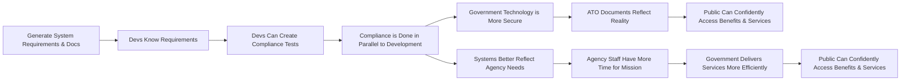

# OpenATO Roadmap

## Products

An overview of each product. Timelines represented below are in relation to that product. If the product is on the roadmap for `Later`, but a feature of said product is slotted for `Now`, then when product work begins `Later`, the first tasks are included in the product's `Now` section.

| Name                        | Description                                             | Abbreviation        | Status                                         |
| --------------------------- | ------------------------------------------------------- | ------------------- | ---------------------------------------------- |
| Requirement Generation Tool | Agency & Impact Profile Builder                         | [RGT](products/RGT) | #2 https://github.com/OpenATO/Roadmap/issues/2 |
| Knowledge Base              | Centralized Reference Files, Standards, & Documentation | [KB](products/KB)   |                                                |

