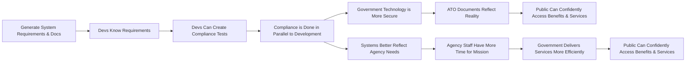
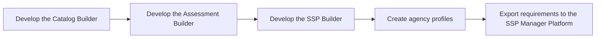

# Requirement Manager

The Requirement Manager is a critical component of the OpenATO ecosystem. It will help agencies simplify the ATO process by providing a suite of tools for generating and assessing system requirements, building security plans, and creating agency profiles. The tool will include a Catalog Builder, an Assessment Builder that integrates MITRE InSpec tests and Heimdal output, an SSP Builder, and a capability for agencies to create profiles that specify their components. The tool will also export requirements to the SSP Manager Platform, enabling agencies to transfer their requirements to the latter platform with ease.

## Need Statement

The Requirement Manager is needed to address the complexity and inefficiencies in the ATO process. By providing a suite of tools for generating and assessing system requirements, building security plans, and creating agency profiles, the tool will help agencies shift compliance left, so that security compliance is built into systems from the start, and development teams can build systems more efficiently. The tool will also help improve the accuracy of ATO documents, ensuring that government technology is more secure and that the public can confidently access the benefits and services they need.

## Roadmap

The Requirement Manager will provide agencies with the tools they need to generate and assess system requirements, build security plans, and create agency profiles. The tool will integrate with the SSP Manager Platform, enabling agencies to transfer their requirements to the latter platform with ease. By shifting compliance left and improving the accuracy of ATO documents, the tool will help improve the security of government technology and increase the efficiency of the ATO process.

### Now

- Develop the Assessment Builder
- Create agency profiles

### Next

- Export requirements to the SSP Manager Platform
- Develop the Catalog Builder
- Develop the SSP Builder

### Later
