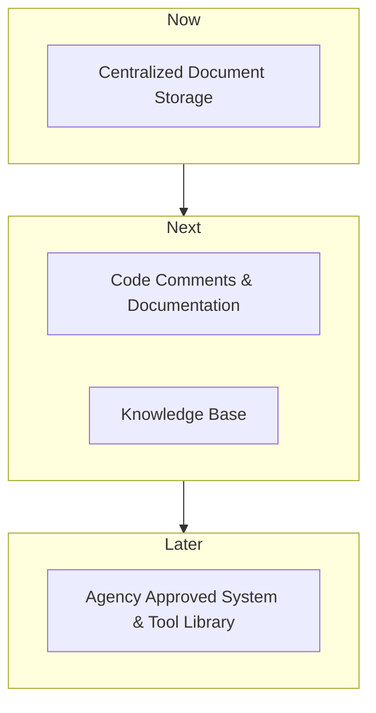

# Agency Knowledge Base

A centralized source of truth for agency profiles, impact profiles, ATOs, and other compliance requirements, the Agency Knowledge Base provides developers with the information they need to build secure systems that meet the needs of the agency.

## Need Statement

The ATO process can be complex and overwhelming, leading to confusion and stress among development teams. The Agency Knowledge Base helps to streamline the control implementation process by providing clear and accessible information about the requirements and standards for compliance and how they relate to the Agency.

## Roadmap

This product aims to provide a comprehensive knowledge base and library for agency-specific information, with a focus on streamlining the control implementation process.

### Features

#### Agency Documentation

Allows for easy access to agency-specific information, including controls, profiles, and components. It provides a clear view of how these elements impact the overall system.

#### Code Comments & Documentation

Provides customized snippets for developers to include comments and documentation within the code, providing a more comprehensive understanding of the system requirements and how they were implemented. These comments will tie back to the Tasks in the Status Manager for monitoring controls.

#### Centralized Document Storage

Allows for the storage of important documents such as the SSP, Agency Profile, Impact Profiles, and other related information, providing a centralized repository for reference by monitoring agents, vendors, and agency staff.

#### Agency Approved System & Tool Library

Provides a library of approved systems and tools for use by the agency, ensuring that all technology is in compliance with relevant requirements and standards.

