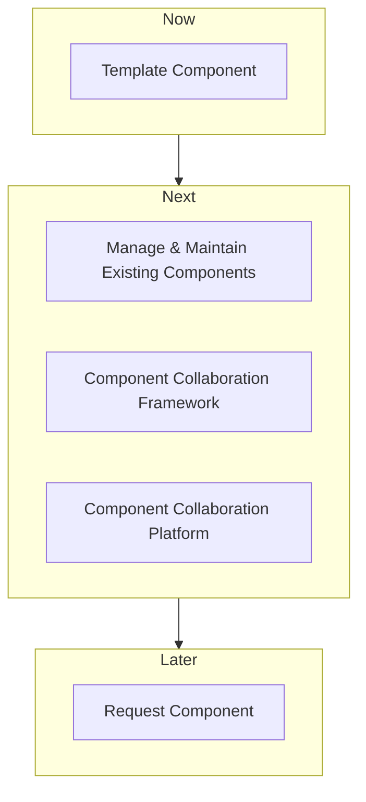

# Component Manager

The Component Manager is a platform that streamlines the creation and management of components for multiple agencies. This product is designed to help improve the quality and efficiency of components and make it easier for agencies to access and utilize them.

## Need Statement

In today's world, many government agencies are facing the same challenges when it comes to creating and managing components. Components are often created in a siloed manner, making it difficult to reuse them across different projects or agencies. The Component Manager addresses this issue by providing a centralized platform for creating and managing components in a collaborative way. This not only saves time and resources, but also ensures that components are of a higher quality and more easily accessible.

## Roadmap

The Component Manager is designed to be a comprehensive solution for creating and managing components. The product roadmap includes the following features:

### Features

#### Component Collaboration Platform

The Component Collaboration Platform allows multiple agencies to collaborate on the creation and management of components. This platform provides a centralized location where agencies can share best practices and feedback, as well as access components created by other agencies.

#### Component Collaboration Framework

The Component Collaboration Framework, also known as the "Component How We Work," provides a set of guidelines and best practices for creating and managing components. This framework helps ensure that components are created in a consistent manner, making it easier for agencies to understand and utilize them.

#### Manage and Maintain Existing Components

The Component Manager provides a mechanism for managing and maintaining existing components that are stored in the Knowledge Base. When components release new functionality, those changes can be modified within the Component Manager. Additionally, any additional config options or controls needed for components can be listed and managed within the platform.

#### Request Component

If a component requires a control to be implemented, and that control is not yet in place, agency staff can request the component through the Component Manager. This request is then sent to the compliance team for approval. Once approved, the tasks needed to implement the control are assigned to the appropriate staff. Once the controls are implemented and passing, the component becomes available in the agency's Knowledge Base Component/Tool/Software Library.

#### Template Component

The Component Manager includes a "template" component that can be easily customized and understood. This template component is designed to be user-friendly, possibly with a GUI, and encourages anyone and everyone to submit their ideas for new components. As more components are implemented and an agency has the necessary controls in place, those components become available in the agency's Knowledge Base Component/Tool/Software Library.

### Workflow

The workflow of the Component Manager is designed to be straightforward and efficient. The following mermaid diagram shows the roadmap flow:

