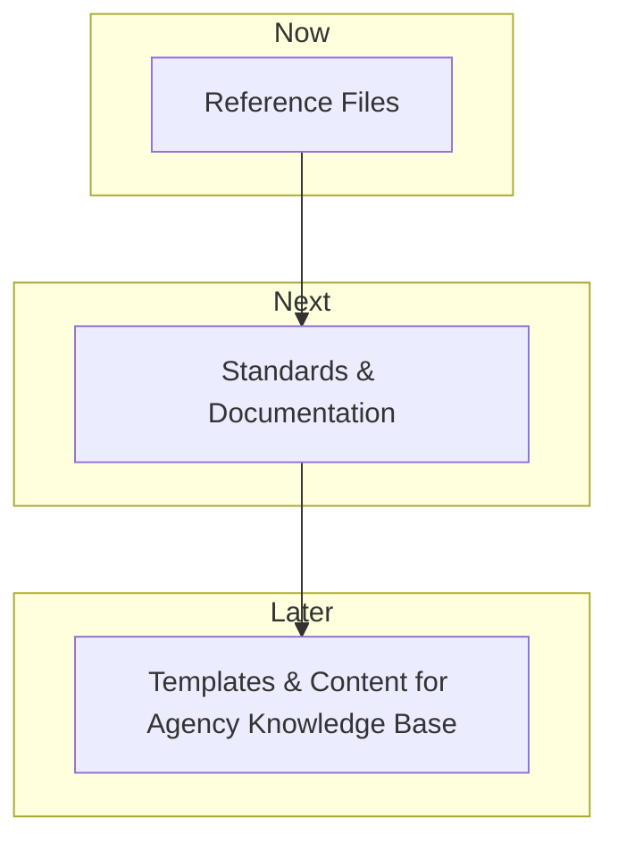

# Knowledge Base

The Knowledge Base is a centralized platform for referencing files, standards, and documentation related to the ATO process. It contains all non-agency specific information, articles, and non-custom knowledge, as well as blank templates for agency and impact profiles, and a component library. The Knowledge Base is designed to be a public resource that makes ATO knowledge accessible to everyone, and will be used to generate agency-specific knowledgebases.

## Need Statement

The Knowledge Base is needed to make ATO knowledge accessible to everyone, reducing stress and confusion about the ATO process for development teams. By having clear and accessible ATO knowledge, development teams can build systems more efficiently, leading to systems that better reflect the needs of the agency and freeing up time for agency staff to focus on the mission. This will result in the government delivering services more effectively, and the public being able to confidently access the benefits and services they need.

## Roadmap

The Knowledge Base will provide a centralized platform for referencing files, standards, and documentation related to the ATO process.

### Features

#### Reference Files

The Knowledge Base will include reference files, making it easier for users to find the information they need. These include the Agency Profile, Impact Profiles, and component library.

#### Standards & Documentation

The Knowledge Base will include standards and documentation related to the ATO process, making it easier for users to understand and comply with the requirements.

#### Templates & Content for Agency Knowledge Base

The Knowledge Base will include templates and content for generating agency-specific knowledgebases, making it easier for agencies to customize their ATO process.

### Workflow

The Knowledge Base will provide a centralized platform for referencing files, standards, and documentation related to the ATO process. It will be a public resource that makes ATO knowledge accessible to everyone, reducing stress and confusion about the ATO process for development teams.

