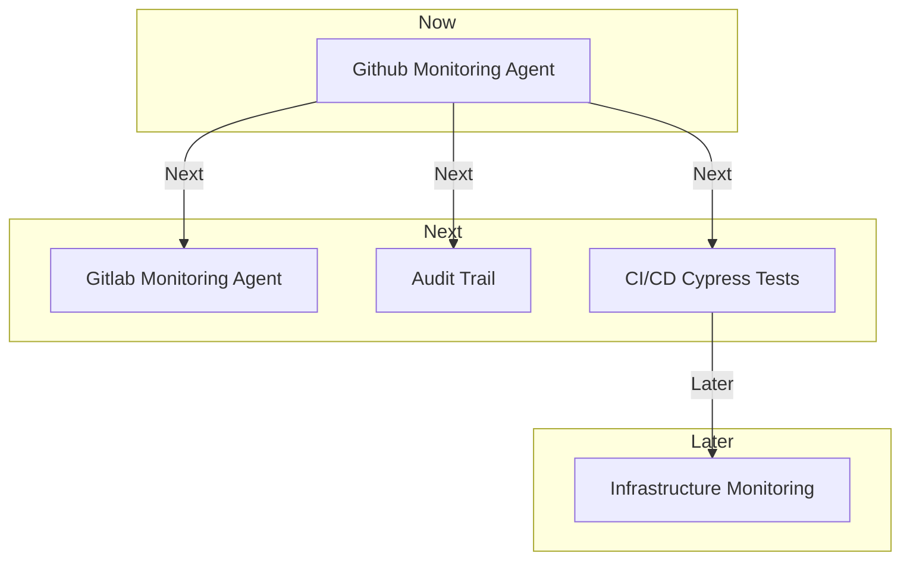

# Monitoring & Review

The Monitoring & Review product will provide agencies with the tools and automations they need to monitor and track compliance effectively. The product will include code repository monitoring agents, CI/CD Cypress Tests, infrastructure monitoring, and audit and control capabilities. By continuously monitoring and tracking compliance, the product will help agency leaders make informed decisions, allocate resources effectively, and ensure that the public can confidently access the benefits and services they need.

## What We're Building

The Monitoring & Review product is a collection of tools and automations that help agencies monitor and track compliance. It includes code repository monitoring agents for Github, Gitlab, and Bitbucket, CI/CD Cypress Tests, infrastructure monitoring, and audit and control capabilities. The product uses infrastructure/system/test schedules/protocols to continuously collect and present evidence that controls are being met.

## Need Statement

The Monitoring & Review product is needed to ensure that agencies can continuously verify the compliance of their systems. This is important because it helps agency leaders make informed decisions and allocate resources effectively. By continuously monitoring and tracking compliance, agency staff will have more time to focus on their mission, which will result in the government delivering services more effectively. Ultimately, this will enable the public to confidently access the benefits and services they need.

## Roadmap

The Monitoring & Review product will provide agencies with the tools and automations they need to monitor and track compliance effectively. The product roadmap will include the following features:

- Code repository monitoring agents (Github, Gitlab, Bitbucket)
- CI/CD Cypress Tests
- Infrastructure Monitoring
- Audit & Control

### Now

- Github Monitoring Agent

### Next

- Audit Trail
- Gitlab Monitoring Agent
- CI/CD Cypress Tests

### Later

- Infrastructure Monitoring
