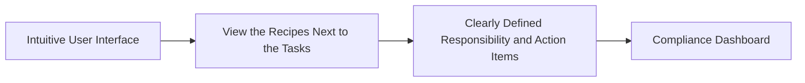

# Status Manager

The Status Manager is a centralized platform for tracking compliance status and managing outstanding tasks for compliance failures. It provides a clear and intuitive user interface for managing and overseeing compliance, with clearly defined responsibility and action items for everyone involved. The platform includes a Compliance Dashboard that displays the status of monitoring agents and links to tasks that need to be completed in order to rectify any compliance failures.

## Need Statement

The Status Manager is needed to streamline the control implementation process and ensure that compliance is done in parallel to development. By providing a centralized platform for tracking compliance status and managing outstanding tasks, the Status Manager will help ensure that Devs know the requirements they need to meet from the start, and can create compliance tests before coding starts. This will result in security compliance being built into systems from the start, and government technology being more secure. Ultimately, this will enable the public to confidently access the benefits and services they need.

## Roadmap

The Status Manager will provide a centralized platform for tracking compliance status and managing outstanding tasks for compliance failures.

### Features

#### Intuitive User Interface

The user interface of the Status Manager will be intuitive and easy to use, making it simple for users to manage and oversee compliance.

#### View the Recipes Next to the Tasks

The Status Manager will provide the ability to view recipes next to the tasks, helping to ensure that users understand the requirements they need to meet.

#### Clearly Defined Responsibility and Action Items

The Status Manager will clearly define the responsibility and action items for everyone involved with compliance, helping to ensure that everyone does what they are best at.

#### Compliance Dashboard

The Compliance Dashboard will provide a clear and concise view of the status of monitoring agents, with links to tasks that need to be completed in order to rectify any compliance failures.

### Workflow

The Status Manager will provide a centralized platform for tracking compliance status and managing outstanding tasks for compliance failures. The product will help streamline the control implementation process and ensure that compliance is done in parallel to development.

